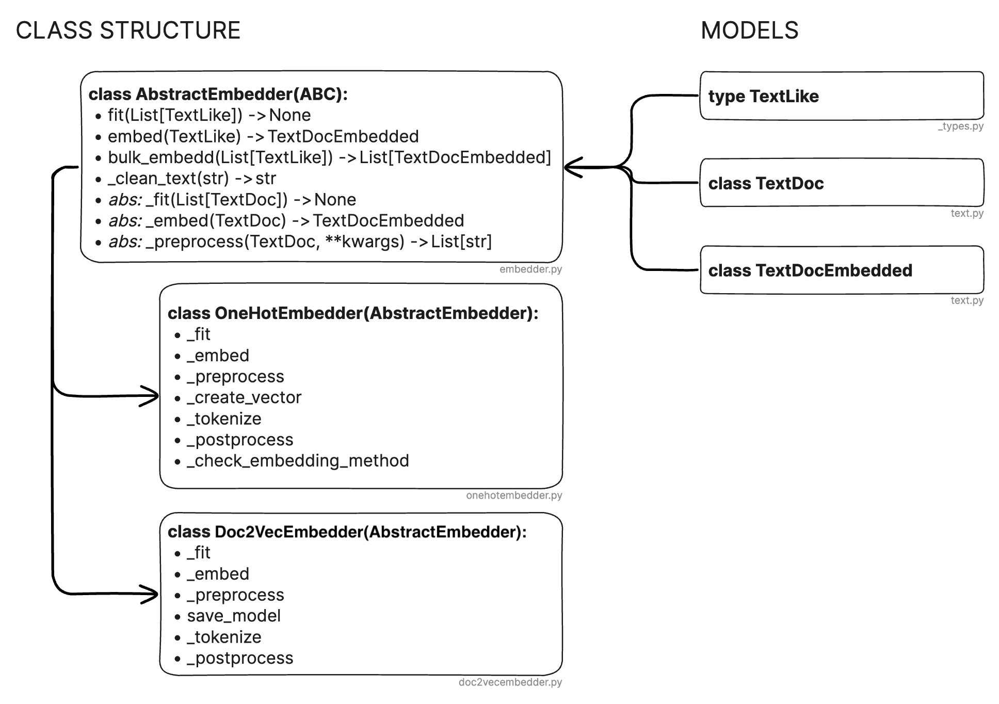
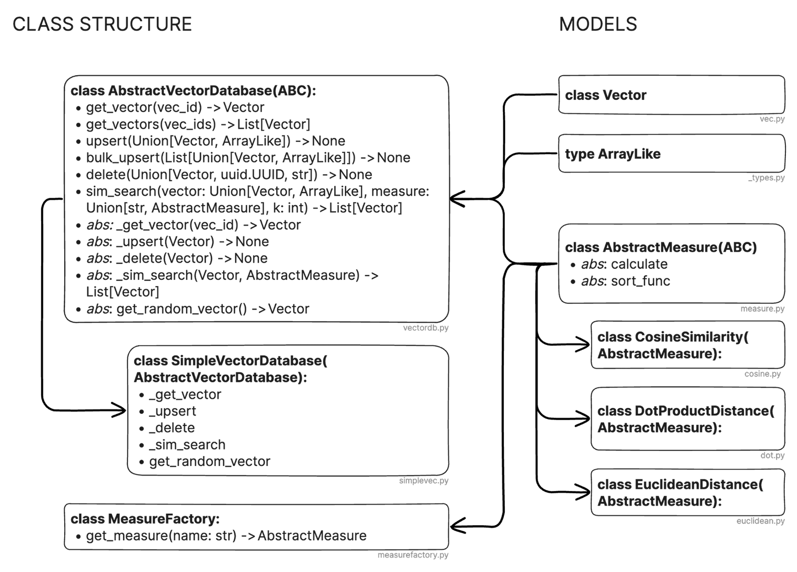

# Document Similarity

## How to use
The notebook `main.ipynb` guides you through the project.

## Overview and Code Architecture
In this project, our objective was to create a Python program that can compute the similarity between text documents. The program processes a corpus of documents and then, given a new search document, can return a list of documents ranked by their similarity to the search document. This task was divided into two main parts: first, creating the embeddings by fitting and training an algorithm to create vector representations of text, and second, embedding texts and storing these representations in a database-like structure for similarity searching.

To facilitate flexibility in our embedding method, we developed an Abstract Base Class (ABC) for embedding algorithms, `AbstractEmbedder`, which serves as a common interface. Implementations of this class must include the methods `_fit`, `_embed`, and `_preprocess` as depicted in the following figure. The `AbstractEmbedder` class defines the public methods, while the private methods are implemented by the concrete classes. This design allows us to standardize input handling and error management across different embedding implementations. Custom data objects like `TextDoc` and `TextDocEmbedded` are used to standardize inputs further and extend functionality without major alterations to the existing codebase.

### Embedding Texts

*Figure: Code structure of the embedding implementation. Source: own illustration.*

The `OneHotEmbedder` class, derived from `AbstractEmbedder`, is central to our document similarity search. It is responsible for one-hot encoding text embeddings and optionally reduces dimensionality using Principal Component Analysis (PCA). The class includes attributes such as `corpus`, which maps words to indices, `corpus_dim`, the count of unique words in the corpus and `vector_dim`, which determines the final vector dimensions of an embedding. If this is not set by the user, the corpus dimension is selected. Otherwise the final dimension is reduced using PCA. The `embedding_method` attribute can be set to ‘one-hot’ or ‘additive’, affecting how the document is represented in vector form. ‘one-hot’ just indicates if a word is in the document whereas ‘additive’ accounts for the number of occurrences of a specific word.

1. **Initialization**: Upon instantiation of the `OneHotEmbedder`, the corpus and dimensions are initialized. The embedding method is also validated and set during this phase.

2. **Preprocessing**: This step involves cleaning the text, tokenizing it, and removing stopwords. These actions are essential for reducing noise and focusing on the meaningful content of the documents. Cleaning the Text involves removing unnecessary or irrelevant information from the text that does not contribute to or might even hinder the analysis. This includes removing special characters and punctuation. Converting all text to a uniform case (usually lowercase) to ensure consistency. Tokenization is the process of breaking down the text into smaller units, typically words or phrases. This is a crucial step as it transforms the text into a format that can be easily analyzed. Stopwords are common words that usually do not carry significant meaning and are removed in this stage. Examples of stopwords include "the", "is", "at", "which", and "on". The file `stopwords.py` includes a list of English stopwords. They are removed beforehand.

3. **Fitting**: The `fit` method is responsible for processing a list of `TextDoc` objects. The primary tasks in this stage include constructing the corpus and forming the document-term matrix. If `vector_dim` is provided, PCA is employed to reduce the dimensions of the data. It’s important to note that if the `vector_dim` exceeds the number of documents, a warning is issued, and the `vector_dim` is adjusted to match the number of documents, ensuring the PCA’s effectiveness.

4. **Embedding Individual Documents**: The `_embed` method is designed to embed a single document. It preprocesses the document, creates its vector representation using the chosen embedding method, and finally returns the embedded representation.

5. **Postprocessing**: If the PCA model is initialized, it is applied to the vector in this final stage. This step reduces the dimensions of the vector based on the PCA model fitted earlier.

We additionally implemented a method, `Doc2VecEmbedder`, using the `gensim` library, which allows for more sophisticated embeddings. The implementation demonstrates the ease of integrating new methods into our system. Other potential embedding methods could include those provided by OpenAI, further showcasing the extensibility of our architecture.

The overall architecture is designed to be modular and extensible, allowing for the integration of various embedding techniques and ensuring that our system can adapt to the evolving needs of document similarity analysis.

### Vector Storage and Similarity Search

The main part of the document similarity search is the `AbstractVectorDatabase` class, a foundational abstract class that provides a standardized interface for vector storage. The code structure is displayed in the following figure. This class ensures a standardized interaction irrespective of the underlying storage mechanism and is very important for maintaining a consistent retrieval process across different implementations. While we've developed a `SimpleVectorDatabase` from this abstract base class, which essentially utilizes a dictionary for vector storage, the architecture can be used to integrate more advanced databases like Pinecone. In our `SimpleVectorDatabase`, vectors are assigned unique IDs and stored in a simple dictionary, allowing for straightforward retrieval. The class is equipped with essential methods such as `_get_vector`, `_upsert`, `_delete`, `_sim_search`, and `get_random_vector`. These methods enable the basic operations necessary for managing vectors in the database—retrieval, insertion, updating, and deletion, along with the ability to perform similarity searches and fetch random vectors for analysis or testing purposes.

Let's focus on the `_sim_search` method. This method leverages the `AbstractMeasure` class and its concrete implementations, demonstrating the system's versatility in applying different similarity measures. Central to this flexibility is the `MeasureFactory` class, which allows for dynamic selection of the metrics. Each measure must implement a `calculate` method for computing the similarity score, along with a `sort_func` that determines the criteria for a 'good' score, which can vary based on the specific measure being applied. The similarity search process is initiated by the `sim_search` function, which accepts a query vector, a similarity measure, and an integer `k` to indicate the number of top similar vectors to return. It compares the query vector against all vectors in the database, calculating similarity scores using the chosen measure. The scores are then sorted based on the `sort_func` method of the employed measure, which dictates the ordering of results to reflect their relevance to the query vector. For example, with cosine similarity, vectors with scores nearing 1 are prioritized, denoting high similarity. The `sim_search` function then returns the top `k` vectors with the closest similarity to the query, as determined by the specified measure.

*Figure: Code structure of the storage and search implementation. Source: own illustration.*

## Similarity Search Measures
Starting with the dot product, its primary advantage lies in its computational efficiency, particularly crucial in high-dimensional vector spaces common in text embeddings. Additionally, studies have demonstrated the dot product's effectiveness in text retrieval, especially when dealing with document images and multilingual textual documents. However, the dot product is not without its drawbacks. It tends to bias similarity measures towards longer documents due to the lack of inherent normalization for document length. Furthermore, it does not account for the angle between vectors, which can be vital for understanding relationships in text embeddings.

Euclidean distance, on the other hand, offers an intuitive and natural interpretation, making it straightforward for various applications, including those involving textual and non-textual embeddings. Its clear geometric interpretation in vector space is one of its key strengths. However, Euclidean distance can be sensitive to the magnitude of vectors, which may not be desirable in all text retrieval contexts. Another significant limitation is its reduced effectiveness in high-dimensional spaces. This limitation can be particularly problematic in text embeddings, where high-dimensional spaces are common.

Cosine similarity, the third measure, excels in its ability to normalize for document length, a critical factor in text retrieval. This normalization makes it suitable for comparing documents of varying sizes. However, this focus on orientation comes at the cost of losing information about the magnitude, which could be important in certain retrieval scenarios. Additionally, cosine similarity may not capture the nuances in highly sparse vectors, which can be a drawback in specific text embedding applications.

# References

1. Tan, C., Huang, W., Yu, Z., & Xu, Y. (2002). Imaged Document Text Retrieval Without OCR. *IEEE Trans. Pattern Anal. Mach. Intell.*, 24, 838-844. [DOI: 10.1109/TPAMI.2002.1008389](https://doi.org/10.1109/TPAMI.2002.1008389)
2. Cohen, E. & Lewis, D. (1997). Approximating matrix multiplication for pattern recognition tasks. *Journal of Algebraic Combinatorics*, 682-691. [DOI: 10.1006/jagm.1998.0989](https://doi.org/10.1006/jagm.1998.0989)
3. Qian, G., Sural, S., Gu, Y., & Pramanik, S. (2004). Similarity between Euclidean and cosine angle distance for nearest neighbor queries. *ACM Transactions*, 1232-1237. [DOI: 10.1145/967900.968151](https://doi.org/10.1145/967900.968151)
4. Kimothi, D., Shukla, A., Biyani, P., Anand, S., & Hogan, J. (2017). Metric learning on biological sequence embeddings. *2017 IEEE 18th International Workshop on Signal Processing Advances in Wireless Communications (SPAWC)*, 1-5. [DOI: 10.1109/SPAWC.2017.8227769](https://doi.org/10.1109/SPAWC.2017.8227769)
5. Santus, E., Wang, H., Chersoni, E., & Zhang, Y. (2018). A Rank-Based Similarity Metric for Word Embeddings. [DOI: 10.18653/v1/P18-2088](https://doi.org/10.18653/v1/P18-2088)
6. Le, Q. V., & Mikolov, T. (2014). Distributed Representations of Sentences and Documents. [arXiv:1405.4053](https://arxiv.org/abs/1405.4053)
7. Rehurek, R. (2022). Doc2Vec - Gensim. [Link](https://radimrehurek.com/gensim/models/doc2vec.html) (Accessed Jan. 2024)
8. OpenAI. (2024). Embeddings - OpenAI. [Link](https://platform.openai.com/docs/guides/embeddings) (Accessed Jan. 2024)
